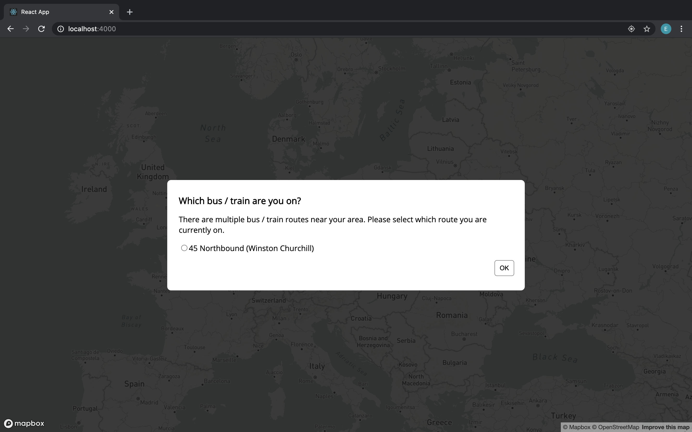
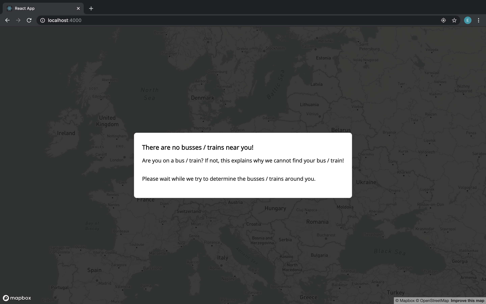
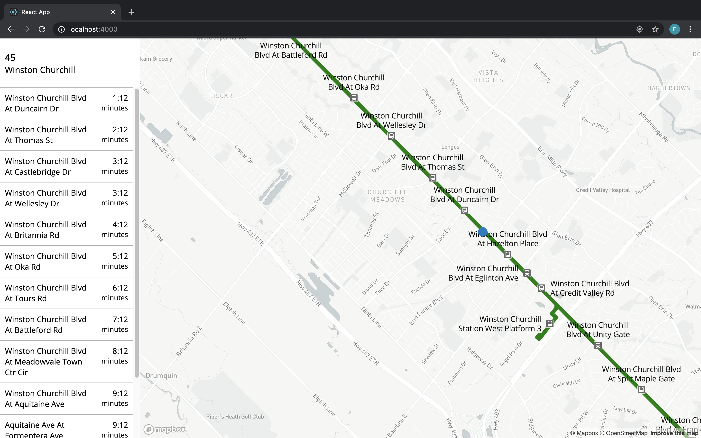

# On Transit App - The Web App

## Description
The web app is a front-facing application that is used to display routes, predict user locations, and dispatch notifications.

### Table of Contents
- Installation
- Usage
- Credits
- License

## Overview of UI:
When users land on the web page, the app asks for geolocation and notification permissions. Grant them. Then, the app detects which bus the user is on. If there is more than one possible bus the user is on, it will ask the user which bus they are on from the list of possible busses obtained.

<div width="100%">
    <p align="center">

    </p>
</div>

If there are no busses / trains available, the screen will look like:
<div width="100%">
    <p align="center">

    </p>
</div>

Once a route is selected, the route's path and its stops are shown on the webpage. It will also predict and display the vehicle's location:
<div width="100%">
    <p align="center">

    </p>
</div>

Furthermore, users can create a notification for a particular stop by going to the left nav bar, hoving on top of your stop, and selecting "Notify Me":
<div width="100%">
    <p align="center">

    </p>
</div>

When the user is 5 minutes before reaching their stop, they will be notified.
<div width="100%">
    <p align="center">

    </p>
</div>

### Installation

#### Pre-requisites:
You will need:
- A unix-based machine
- Node v8.0 +
- NPM v6.5 +
- MapBox API key (free from [mapbox.com](https://www.mapbox.com/))

#### Steps:
1. Install package dependencies by opening up the terminal and running ```npm install```
2. Make a copy of ```.env-template``` and name it ```.env```
3. Fill in the details in ```.env``` such as specifying the API keys and the endpoints
4. Run ```npm start```

### Deploying on Heroku
1. Authenticate with Heroku:
    ```bash
    heroku auth:login
    heroku container:login
    ```

2. Make a file called ```.env.production``` and store your keys into this file

3. Run the following:
    ```bash
    docker build -t on_transit_app .
    docker tag on_transit_app registry.heroku.com/on-transit-app/web
    docker push registry.heroku.com/on-transit-app/web
    heroku container:release web --app on-transit-app
    ```

### Usage
Please note that this project is used for educational purposes and is not to be used commercially. We are not liable for any damages or changes done by this project.
    
### Credits
Emilio Kartono

### Licence
This project is protected under the GNU Licence. Please refer to LICENCE.txt in the root directory of this repository for further details.